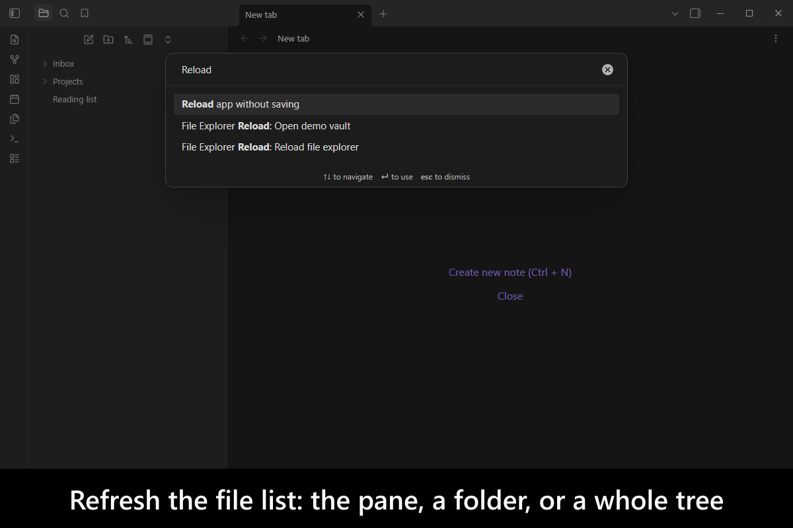

# File Explorer Reload

[](https://www.buymeacoffee.com/mnaoumov) [](https://github.com/mnaoumov/obsidian-file-explorer-reload/releases) [](https://github.com/mnaoumov/obsidian-file-explorer-reload/releases) [](https://github.com/mnaoumov/obsidian-file-explorer-reload)

Copy, move or delete files outside [Obsidian](https://obsidian.md/) while it is open — from your file manager, a script, a sync client — and the File Explorer pane can fall behind what is actually on disk. It keeps listing files that are gone, and misses files that arrived.

The usual remedy is **Reload app without saving**, which discards your whole session to refresh one pane and is slow on a large vault. This plugin refreshes only the file list: the entire pane, a single folder, or a folder and everything beneath it.

<!-- markdownlint-disable MD033 -->

<a href="https://github.com/mnaoumov/obsidian-file-explorer-reload/blob/HEAD/images/screenshots/screenshot-desktop-1.png"></a>

<!-- markdownlint-enable MD033 -->

## Demo vault

**The documentation is a demo vault.** The feature has a note that explains what it does and why you would want it, with a nested folder to refresh.

**[Start reading here](<./demo-vault/00 Start.md>)** — it is plain markdown, so it works on GitHub with nothing installed.

A copy of the vault ships with every release. You can access it via any of the following:

1. Running the **File Explorer Reload: Open demo vault** command.
2. Downloading `file-explorer-reload-demo-vault-<version>.zip` (`<version>` is the release version) from the [Releases](https://github.com/mnaoumov/obsidian-file-explorer-reload/releases).
3. Browsing its source in [`demo-vault/`](./demo-vault/README.md) in this repository.

## What it does

- **Reload File Explorer** rebuilds the whole pane from disk, from the Command Palette. [01 Reload file explorer](<./demo-vault/01 Reload file explorer.md>)
- **Reload Folder** and **Reload Folder with Subfolders** do the same for one part of the tree, from the folder right-click menu — the first shallow, the second all the way down. [01 Reload file explorer](<./demo-vault/01 Reload file explorer.md>)

There is nothing to configure.

## Installation

The plugin is available in [the official Community Plugins repository](https://obsidian.md/plugins?id=file-explorer-reload).

### Beta versions

To install the latest beta release of this plugin (regardless if it is available in [the official Community Plugins repository](https://obsidian.md/plugins) or not), follow these steps:

1. Ensure you have the [BRAT plugin](https://obsidian.md/plugins?id=obsidian42-brat) installed and enabled.
2. Click [Install via BRAT](https://intradeus.github.io/http-protocol-redirector?r=obsidian://brat?plugin=https://github.com/mnaoumov/obsidian-file-explorer-reload).
3. An Obsidian pop-up window should appear. In the window, click the `Add plugin` button once and wait a few seconds for the plugin to install.

## Debugging

By default, debug messages for this plugin are hidden.

To show them, run the following command:

```js
window.DEBUG.enable('file-explorer-reload');
```

For more details, refer to the [documentation](https://mnaoumov.dev/obsidian-dev-utils/guides/debugging/).

## Changelog

All notable changes to this project will be documented in the [CHANGELOG](./CHANGELOG.md).

## Contributing

Contributions are welcome — see [CONTRIBUTING](./CONTRIBUTING.md) to get set up.

## Support

<!-- markdownlint-disable MD033 -->

<a href="https://www.buymeacoffee.com/mnaoumov" target="_blank"></a>

<!-- markdownlint-enable MD033 -->

## My other Obsidian resources

[See my other Obsidian resources](https://github.com/mnaoumov/obsidian-resources).

## License

© [Michael Naumov](https://github.com/mnaoumov/)
